# Workaholic - Escrow-Based Freelance Platform

A full-featured Flutter mobile application that connects clients with freelancers through a secure escrow payment system. Built with Flutter, Riverpod state management, and REST API integration.

[](https://flutter.dev)
[](https://dart.dev)
[](LICENSE)

## Overview

Workaholic is a modern freelancing platform that implements milestone-based project management with secure escrow payments. Clients can post projects, review proposals, and manage freelancer work through milestone submissions and approvals. Freelancers can browse projects, submit proposals, and receive secure payments upon milestone completion.

---

## Key Features

### For Clients
-  **Post Projects** - Create detailed projects with categories, budgets, and milestone-based payments
-  **Manage Proposals** - Review and accept freelancer proposals with ratings
-  **Review Work** - Approve or reject milestone submissions with feedback
-  **Wallet System** - Add funds via Razorpay, track transactions
-  **Rate Freelancers** - Submit ratings after project completion
-  **Notifications** - Real-time updates on proposals, submissions, and project status

### For Freelancers
-  **Browse Projects** - Filter and search available projects
-  **Submit Proposals** - Apply to projects with custom cover letters
-  **Submit Work** - Upload milestone deliverables with descriptions
-  **Earnings** - Track payments, view transaction history
-  **Profile Management** - Showcase skills, education, and experience
-  **Notifications** - Updates on proposal status, milestone approvals, and payments

### Common Features
-  **Secure Authentication** - JWT-based auth with role-based access
-  **Contact Exchange** - Phone numbers shared after proposal acceptance
-  **Transaction History** - Complete audit trail of all payments
-  **Modern UI/UX** - Clean, intuitive interface with smooth animations
-  **Pull-to-Refresh** - Real-time data updates across all screens

---

##  Screenshots

### Authentication & Onboarding

|                  Login Screen                   |                  Register Screen                   |                      Profile Setup                      |
|:-----------------------------------------------:|:--------------------------------------------------:|:-------------------------------------------------------:|
| 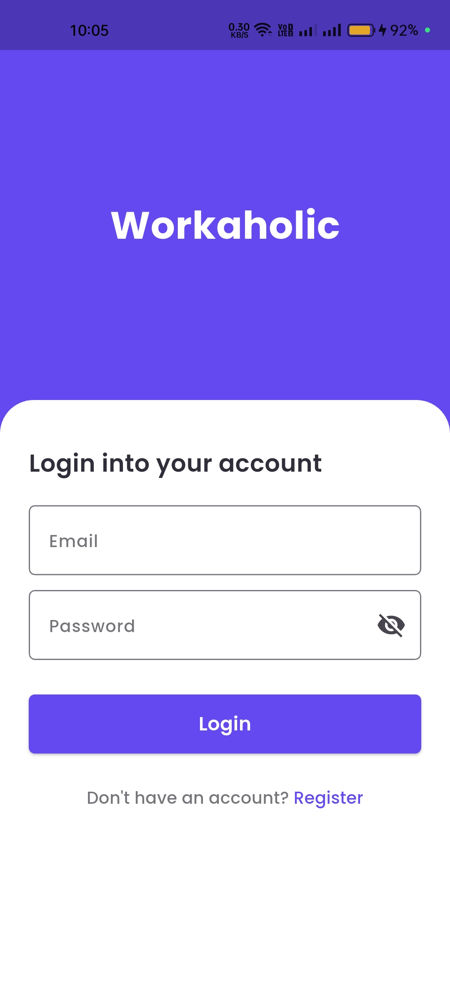 | 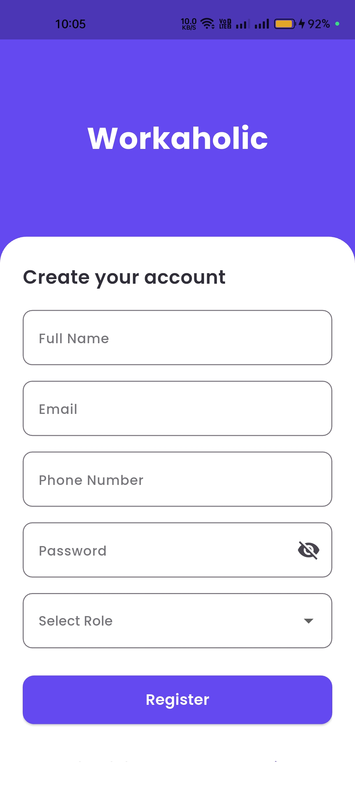 | 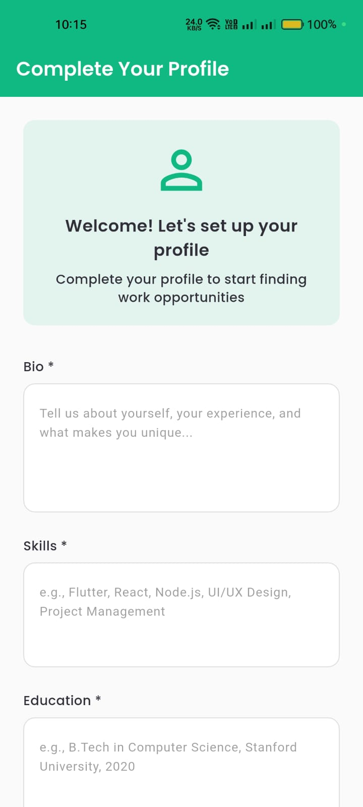 |

### Client Dashboard & Projects

|                      Client Dashboard                      |                      Create Project                      |                      My Projects                      |
|:----------------------------------------------------------:|:--------------------------------------------------------:|:-----------------------------------------------------:|
| 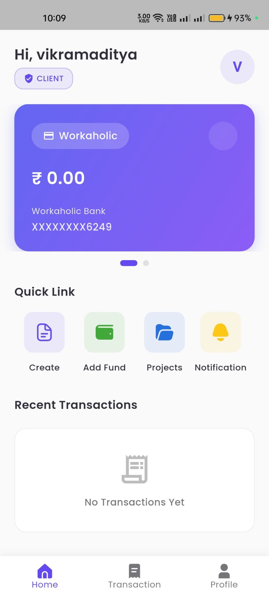 | 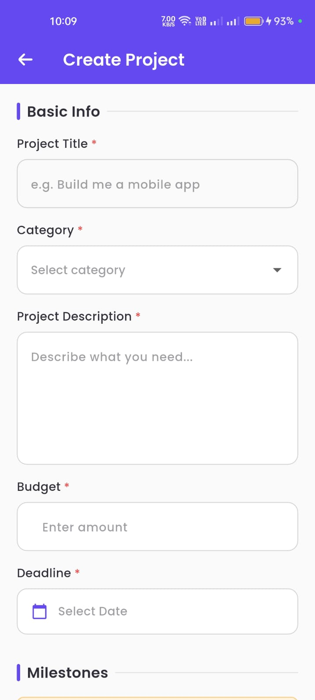 | 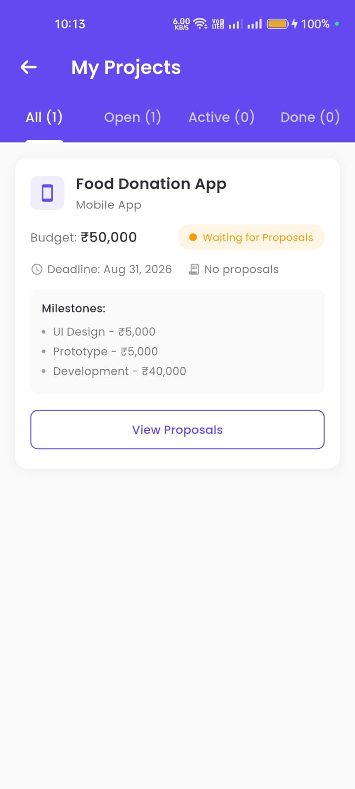 |

### Proposals & Reviews

|                   View Proposals                    |                      Review Submissions                      |                      Complete Project                      |
|:---------------------------------------------------:|:------------------------------------------------------------:|:----------------------------------------------------------:|
|  | 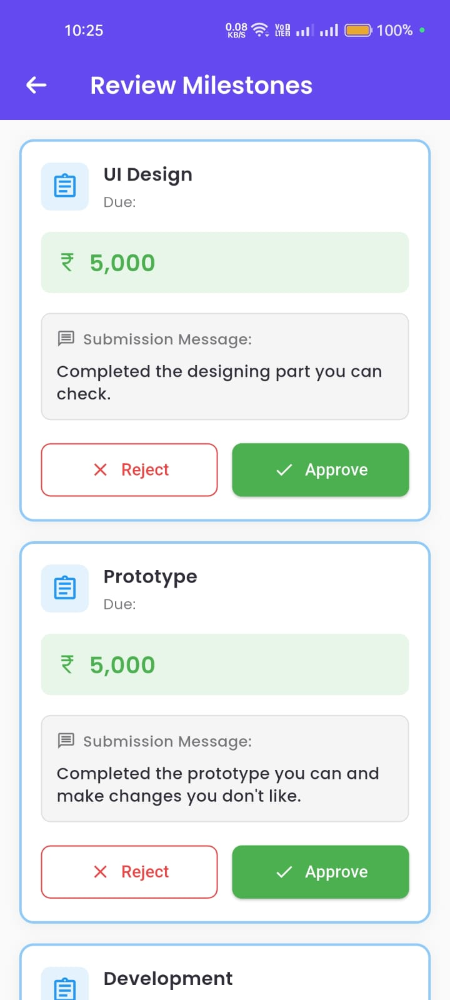 | 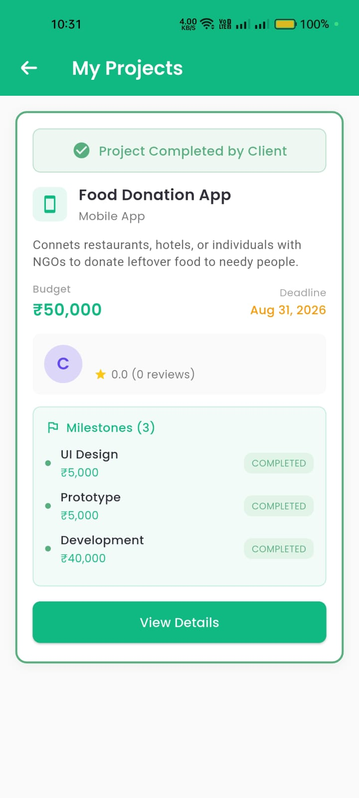 |

### Freelancer Dashboard & Work

|                      Freelancer Dashboard                      |                      Available Projects                      |                      Assigned Projects                      |
|:--------------------------------------------------------------:|:------------------------------------------------------------:|:-----------------------------------------------------------:|
| 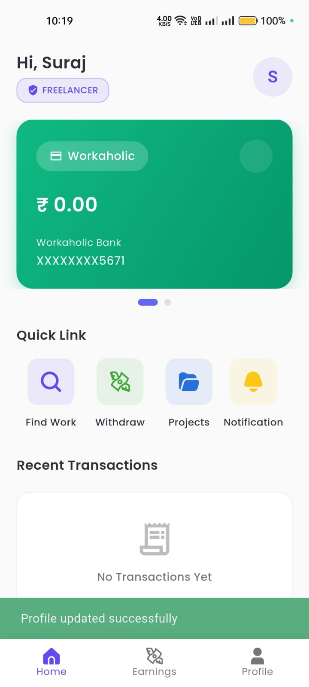 | 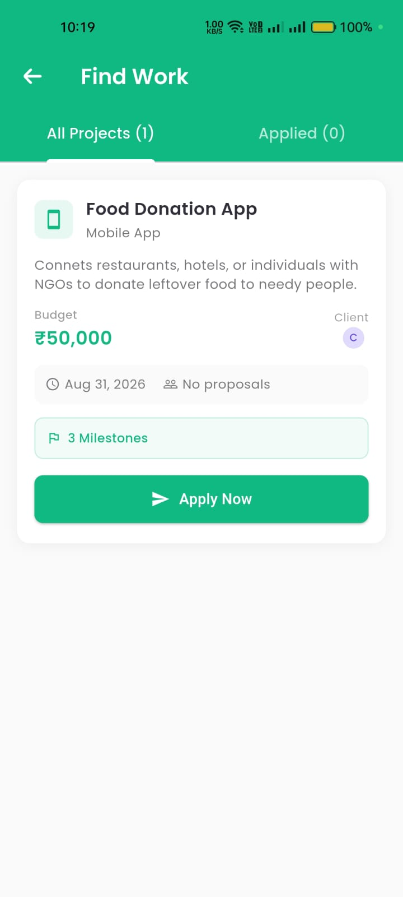 | 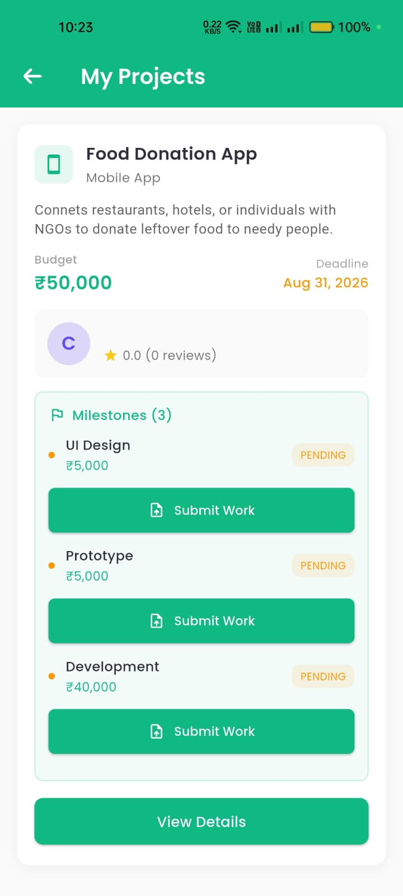 |

### Payments & Transactions

|                Add Funds (Razorpay)                 |                      Transactions                      |                      Earnings                      |
|:---------------------------------------------------:|:------------------------------------------------------:|:--------------------------------------------------:|
| 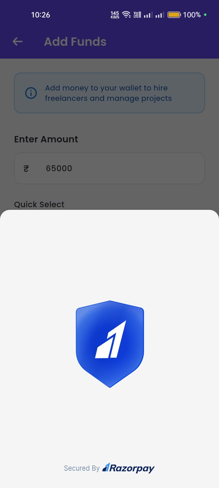 | 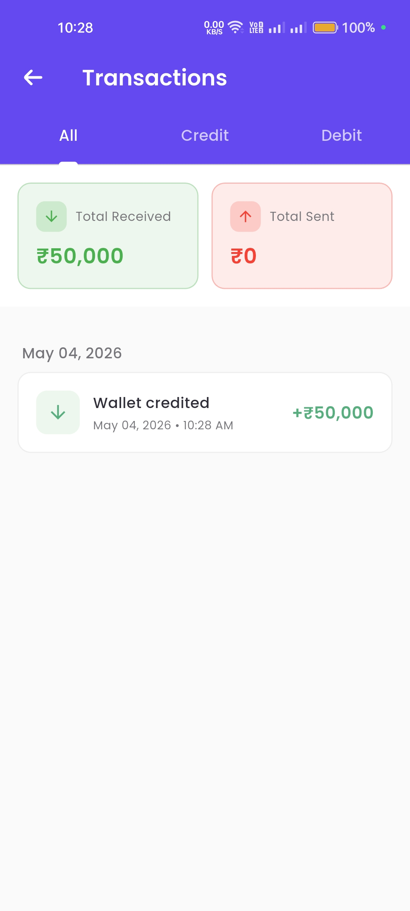 | 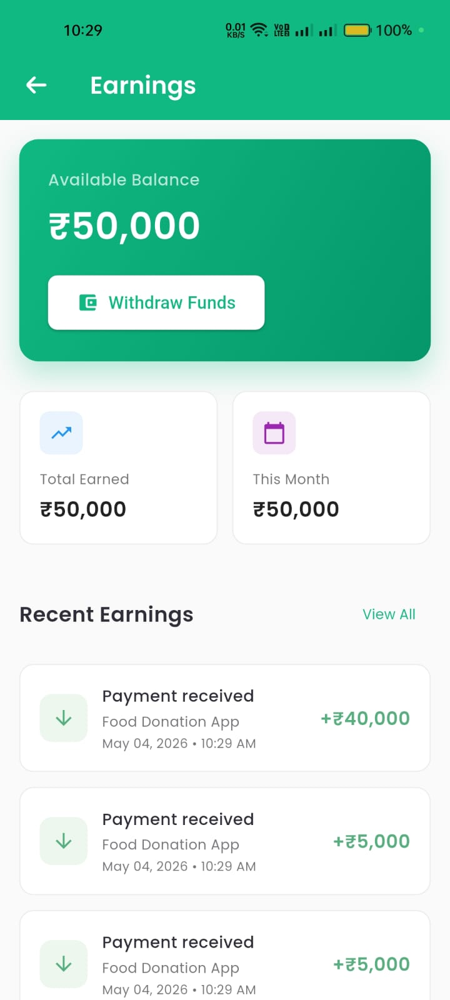 |

### Notifications & Profile

|                      Notifications                      |                   Freelancer Profile                   |                 Rate Freelancer                  |
|:-------------------------------------------------------:|:------------------------------------------------------:|:------------------------------------------------:|
| 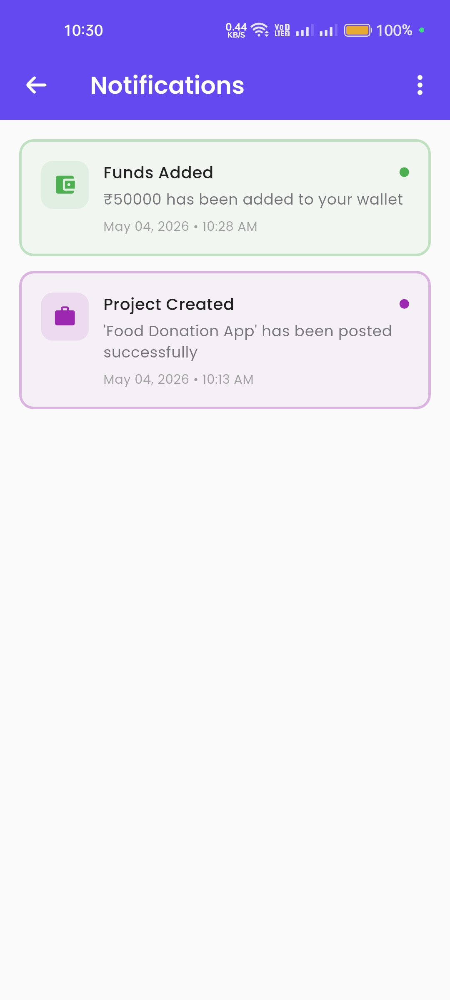 | 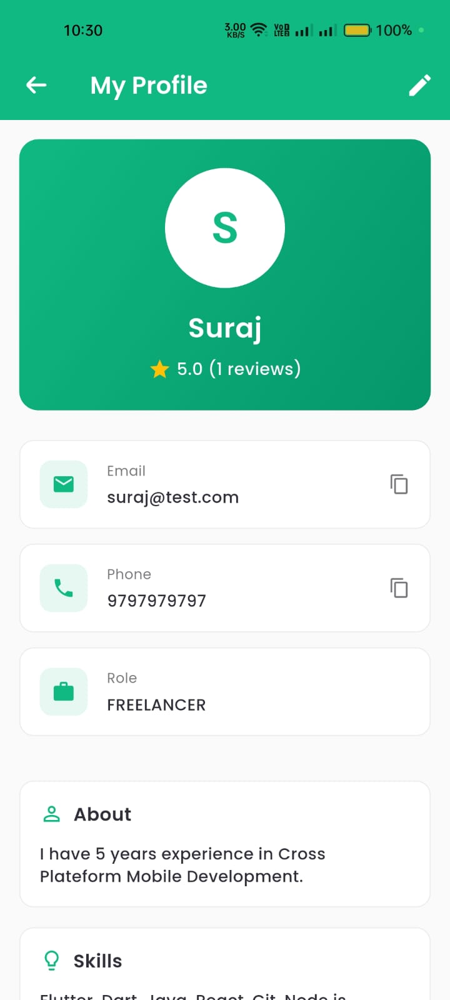 | 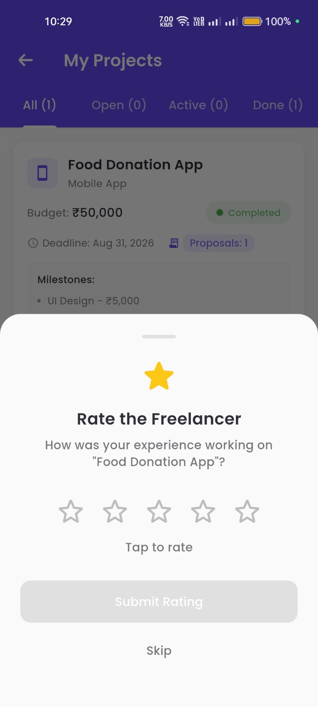 |

---

##  Tech Stack

### Frontend
- **Framework:** Flutter 3.38.5
- **Language:** Dart 3.10.4
- **State Management:** Riverpod 3.2.1
- **UI Components:** 
  - flutter_screenutil (Responsive design)
  - flutter_svg (Vector graphics)
  - intl (Date formatting & localization)

### Backend Integration
- **API:** REST API (Springboot)
- **Authentication:** JWT Bearer tokens
- **Storage:** flutter_secure_storage (Encrypted local storage)
- **Payment Gateway:** Razorpay (Demo: `rzp_test_1DP5mmOlF5G5ag`)

### Key Packages
```yaml
dependencies:
  flutter_riverpod: ^2.6.1
  flutter_screenutil: ^5.9.3
  flutter_secure_storage: ^9.2.2
  http: ^1.2.2
  intl: ^0.19.0
  flutter_svg: ^2.0.16
  razorpay_flutter: ^1.3.7
```

---

## Getting Started

### Prerequisites
- Flutter SDK (3.24.5 or higher)
- Dart SDK (3.5.4 or higher)
- Android Studio / VS Code
- Android device or emulator
- Backend API running (see API Configuration)

### Installation

1. **Clone the repository**
```bash
git clone https://github.com/yourusername/workaholic.git
cd workaholic
```

2. **Install dependencies**
```bash
flutter pub get
```

3. **Configure API endpoint**
```dart
// lib/services/api_service.dart
static const String baseUrl = "https://your-api-url.com";
```

4. **Configure Razorpay** (Optional - for payments)
```dart
// lib/screens/client/add_fund_scr.dart
static const String razorpayKeyId = "your_razorpay_key";
```

5. **Run the app**
```bash
flutter run
```

---

## API Documentation

### Base URL
```
https://your-api-url.com
```

### Authentication Endpoints

| Method | Endpoint | Auth | Description | Request Body |
|--------|----------|------|-------------|--------------|
| POST | `/auth/register` | None | Register new user | `{ "name": "string", "email": "string", "password": "string", "role": "CLIENT/FREELANCER", "phoneNumber": "string" }` |
| POST | `/auth/login` | None | Login user | `{ "email": "string", "password": "string" }` |

### Project Endpoints

| Method | Endpoint | Auth | Description |
|--------|----------|------|-------------|
| POST | `/projects/create` | Bearer | Create new project with milestones |
| GET | `/projects/my` | Bearer | Get user's projects (filter by status) |
| GET | `/projects/available` | Bearer | Get available projects for freelancers |
| GET | `/projects/assigned` | Bearer | Get projects assigned to freelancer |

**Create Project Request:**
```json
{
  "title": "string",
  "description": "string",
  "category": "string",
  "budget": "number",
  "deadline": "YYYY-MM-DD",
  "milestones": [
    {
      "name": "string",
      "amount": "number",
      "dueDate": "YYYY-MM-DD"
    }
  ]
}
```

### Proposal Endpoints

| Method | Endpoint | Auth | Description |
|--------|----------|------|-------------|
| POST | `/applications/apply/{projectId}` | Bearer | Submit proposal to a project |
| GET | `/applications/proposal/{projectId}` | Bearer | Get all proposals for a project |
| POST | `/applications/proposal/{proposalId}/accept` | Bearer | Accept a freelancer proposal |

**Submit Proposal Request:**
```json
{
  "description": "string"
}
```

### Milestone Endpoints

| Method | Endpoint | Auth | Description |
|--------|----------|------|-------------|
| POST | `/phases/submit/{milestoneId}` | Bearer | Submit milestone for review |
| POST | `/phases/approve/{milestoneId}` | Bearer | Approve submitted milestone |
| POST | `/phases/reject/{milestoneId}` | Bearer | Reject submitted milestone |
| POST | `/phases/project/complete/{projectId}` | Bearer | Mark project as completed |

**Submit Milestone Request:**
```json
{
  "message": "string (min 20 characters)"
}
```

### Wallet Endpoints

| Method | Endpoint | Auth | Description |
|--------|----------|------|-------------|
| GET | `/wallet` | Bearer | Get current wallet balance |
| POST | `/wallet/add` | Bearer | Add funds to wallet via Razorpay |

**Add Funds Request:**
```json
{
  "amount": "number"
}
```

### Profile Endpoints

| Method | Endpoint | Auth | Description |
|--------|----------|------|-------------|
| GET | `/profile/{userId}` | Bearer | Get user profile |
| POST | `/profile` | Bearer | Create/update freelancer profile |
| GET | `/freelancer/{freelancerId}` | Bearer | Get freelancer details with rating |

**Create/Update Profile Request:**
```json
{
  "bio": "string",
  "skills": "string",
  "education": "string"
}
```

### Rating Endpoint

| Method | Endpoint | Auth | Description |
|--------|----------|------|-------------|
| POST | `/rating/give/{freelancerId}` | Bearer | Rate freelancer (1-5 stars) |

**Give Rating Request:**
```json
{
  "rating": "number (1-5)"
}
```

---

## Project Structure

```
lib/
├── commons/
│   ├── utils/
│   │   └── app_colors.dart          # Color constants
│   └── widgets/
│       ├── drawer_widget.dart       # Navigation drawer
│       ├── text_widget.dart         # Custom text styles
│       ├── transactions_widget.dart # Transaction components
│       ├── wallet_widget.dart       # Wallet card widget
│       └── quick_link_widget.dart   # Dashboard quick links
├── models/
│   ├── notification_model.dart      # Notification data model
│   ├── profile_model.dart           # User profile model
│   ├── project_model.dart           # Project, Milestone models
│   ├── proposal_model.dart          # Proposal model
│   └── transaction_model.dart       # Transaction model
├── providers/
│   ├── auth_provider.dart           # Authentication state
│   ├── notification_provider.dart   # Notifications state
│   ├── proposal_count.dart          # Proposal count state
│   ├── transaction_provider.dart    # Transactions state
│   └── wallet_provider.dart         # Wallet balance state
├── screens/
│   ├── authentication/
│   │   ├── auth_scr.dart           # Auth wrapper
│   │   ├── login_scr.dart          # Login screen
│   │   ├── register_scr.dart       # Registration with phone
│   │   └── auth_gate_scr.dart      # Auth gate with profile check
│   ├── client/
│   │   ├── client_dash.dart        # Client dashboard
│   │   ├── post_scr.dart           # Create project
│   │   ├── projects_scr.dart       # My projects (tabs: All/Open/Active/Done)
│   │   ├── project_proposal_scr.dart # View proposals
│   │   ├── milestone_approval_scr.dart # Review milestone submissions
│   │   └── add_fund_scr.dart       # Add funds via Razorpay
│   ├── freelancer/
│   │   ├── freelancer_dash.dart    # Freelancer dashboard
│   │   ├── available_projects.dart # Browse projects (tabs: All/Applied)
│   │   ├── assigned_scr.dart       # Assigned projects with client phone
│   │   ├── profile_setup_screen.dart # Profile setup (mandatory)
│   │   ├── profile_view_screen.dart # View profile with rating
│   │   └── earnings_screen.dart    # Earnings & stats
│   └── common/
│       ├── notifications_screen.dart # Notifications list
│       └── transactions_screen.dart  # Transaction history (tabs: All/Credit/Debit)
├── services/
│   ├── api_service.dart            # All API calls
│   ├── notification_service.dart   # Local notifications (user-specific)
│   └── transaction_service.dart    # Transaction storage (user-specific)
└── main.dart                        # App entry point
```

---

## User Flows

### Client Flow
```
Register (with phone) → Login → Dashboard → Create Project 
→ Review Proposals → Accept Proposal (exchange phone numbers)
→ Review Milestone Submissions → Approve/Reject 
→ Complete Project → Rate Freelancer
```

### Freelancer Flow
```
Register (with phone) → Login → Complete Profile (Mandatory) 
→ Dashboard → Browse Projects → Submit Proposal 
→ Assigned Project (get client phone) → Submit Milestone 
→ Receive Payment → View Earnings
```

---

##  Key Features Implementation

### 1. **Milestone-Based Payments**
Projects are divided into milestones with individual amounts. Payments are released only after client approval:
```dart
// Milestone States:
// PENDING → Freelancer can submit
// SUBMITTED → Under client review
// APPROVED → Payment released to freelancer
// REJECTED → Freelancer must resubmit
// COMPLETED → Final state
```

### 2. **Escrow System**
Client adds funds to wallet before project begins. Funds are held and released per milestone:
```dart
// Client Workflow:
// 1. Add funds via Razorpay (₹10 - ₹1,00,000)
// 2. Create project with budget
// 3. Accept proposal
// 4. Approve milestone → Wallet deducted, freelancer credited
```

### 3. **User-Specific Storage**
Notifications and transactions are stored per user ID to prevent data leakage:
```dart
// Storage keys format:
// - transactions_{userId}
// - notifications_{userId}
// - Applied projects stored in FlutterSecureStorage
// - All cleared on logout
```

### 4. **Notification System**
Local notification system with multiple trigger types:
```dart
// Notification Types:
// - Proposal (new proposal received)
// - Milestone (submission, approval, rejection)
// - Project (created, completed)
// - Payment (funds added, payment sent/received)
```

### 5. **Phone Number Exchange**
Phone numbers are only shared after proposal acceptance:
```dart
// Visibility:
// - Shown in accepted proposals screen (client sees freelancer phone)
// - Shown in assigned projects (freelancer sees client phone)
// - Displayed in freelancer profile view
// - Copy to clipboard functionality
```

### 6. **Rating System**
Clients can rate freelancers after project completion:
```dart
// Features:
// - 1-5 star rating system
// - Displayed in freelancer profile
// - Shows average rating and total reviews
// - Rating dialog with star selection UI
```

---

##  Configuration

### 1. **API Service Configuration**

Update the base URL in `lib/services/api_service.dart`:

```dart
class ApiService {
  static const String baseUrl = "https://your-backend-url.com";
  
  // Token storage
  static const storage = FlutterSecureStorage();
  static const tokenStore = storage;
}
```

### 2. **Razorpay Configuration**

Update Razorpay key in `lib/screens/client/add_fund_scr.dart`:

```dart
void openRazorpay(double amount) {
  var options = {
    'key': 'YOUR_RAZORPAY_KEY_ID', // Replace with your key
    'amount': (amount * 100).toInt(), // Amount in paise
    'name': 'Workaholic',
    'description': 'Add Funds to Wallet',
    'prefill': {
      'contact': userPhone,
      'email': userEmail,
    }
  };
}
```

---

##  Known Issues & Future Enhancements

### Current Limitations
- ⚠️ Notifications are local-only (no push notifications)
- ⚠️ Phone numbers visible only after proposal acceptance
- ⚠️ Demo Razorpay integration (test mode)
- ⚠️ No real-time chat between client and freelancer
- ⚠️ No file upload for milestone submissions
- ⚠️ No withdraw functionality for clients and freelancers

### Planned Features
-  WebSocket integration for real-time updates
-  In-app chat system between client and freelancer
-  File upload support for milestone submissions
-  Multi-language support (i18n)
-  Advanced search and filters for projects
-  Email notifications
-  Multiple payment gateway support (Stripe, PayPal)
-  Push notifications (Firebase Cloud Messaging)
-  Withdraw funds to bank account
-  Settings screen for user preferences
-  Edit project functionality
-  Two-factor authentication

---

## Build & Deployment

### Android Build

```bash
# Build APK
flutter build apk --release

# Build App Bundle
flutter build appbundle --release

# Build APK for specific architecture
flutter build apk --target-platform android-arm64 --release
```

---

## Security Best Practices

1. **Token Management**
   - JWT tokens stored in FlutterSecureStorage
   - Auto logout on 401 responses
   - Session restoration on app restart

2. **Input Validation**
   - Form validation on all user inputs
   - Email regex validation
   - Password strength requirements
   - Phone number format validation

3. **API Security**
   - HTTPS only connections
   - Bearer token authentication
   - Request/response logging in debug mode

4. **Data Privacy**
   - User-specific storage keys
   - Data cleared on logout
   - No sensitive data in logs (production)

---

## Contributing

Contributions are welcome! Please follow these guidelines:

1. Fork the repository
2. Create a feature branch (`git checkout -b feature/AmazingFeature`)
3. Commit your changes (`git commit -m 'Add some AmazingFeature'`)
4. Push to the branch (`git push origin feature/AmazingFeature`)
5. Open a Pull Request

### Code Style
- Follow Flutter's official style guide
- Use meaningful variable names
- Add comments for complex logic
- Write descriptive commit messages

---

## License

This project is licensed under the MIT License - see the [LICENSE](LICENSE) file for details.

```
MIT License

Copyright (c) 2026 VikramadityaDev

Permission is hereby granted, free of charge, to any person obtaining a copy
of this software and associated documentation files (the "Software"), to deal
in the Software without restriction, including without limitation the rights
to use, copy, modify, merge, publish, distribute, sublicense, and/or sell
copies of the Software, and to permit persons to whom the Software is
furnished to do so, subject to the following conditions:

The above copyright notice and this permission notice shall be included in all
copies or substantial portions of the Software.

THE SOFTWARE IS PROVIDED "AS IS", WITHOUT WARRANTY OF ANY KIND, EXPRESS OR
IMPLIED, INCLUDING BUT NOT LIMITED TO THE WARRANTIES OF MERCHANTABILITY,
FITNESS FOR A PARTICULAR PURPOSE AND NONINFRINGEMENT. IN NO EVENT SHALL THE
AUTHORS OR COPYRIGHT HOLDERS BE LIABLE FOR ANY CLAIM, DAMAGES OR OTHER
LIABILITY, WHETHER IN AN ACTION OF CONTRACT, TORT OR OTHERWISE, ARISING FROM,
OUT OF OR IN CONNECTION WITH THE SOFTWARE OR THE USE OR OTHER DEALINGS IN THE
SOFTWARE.
```

---

## Developer

**Your Name**
- GitHub: [@VikramadityaDev](https://github.com/VikramadityaDev)
- Email: vikramadityaDev@proton.me

---

## Acknowledgments

- Flutter team for the amazing framework
- Riverpod for elegant state management
- Razorpay for payment integration
- Community contributors and testers

---

## Support

For support, email vikramadityaDev@proton.me or open an issue in the repository.

---

## Project Status

**Current Version:** 1.0.0

**Status:** ✅ Active Development

**Last Updated:** May 2026

---

## Features Breakdown

### Completed
- [x] User authentication (JWT)
- [x] Role-based dashboards
- [x] Project creation with milestones
- [x] Proposal system
- [x] Milestone workflow (submit/approve/reject)
- [x] Escrow wallet integration
- [x] Razorpay payment gateway
- [x] Transaction history
- [x] Local notifications
- [x] Rating system
- [x] Phone number exchange
- [x] Profile management

### In Progress
- [ ] Real-time chat
- [ ] File uploads
- [ ] Push notifications

### Planned
- [ ] Withdraw functionality
- [ ] Multi-language support
- [ ] Email notifications
- [ ] Advanced search filters

---

## Show Your Support

If you found this project helpful, please give it a ⭐️!

---

<p align="center">Made with ❤️ VikramadityaDev</p>
<p align="center">© 2026 Workaholic. All rights reserved.</p>
